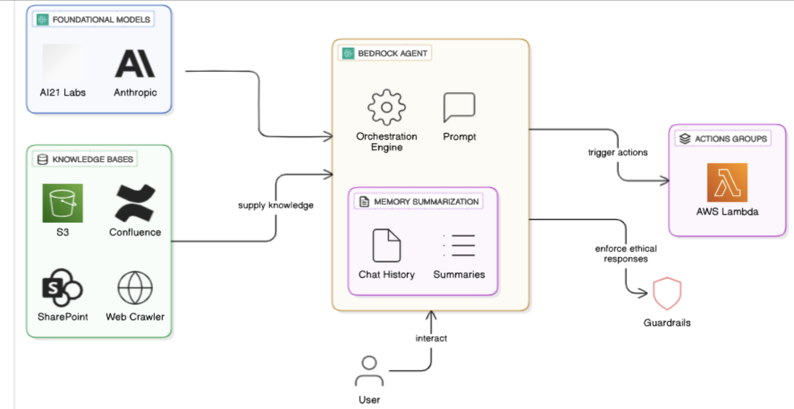
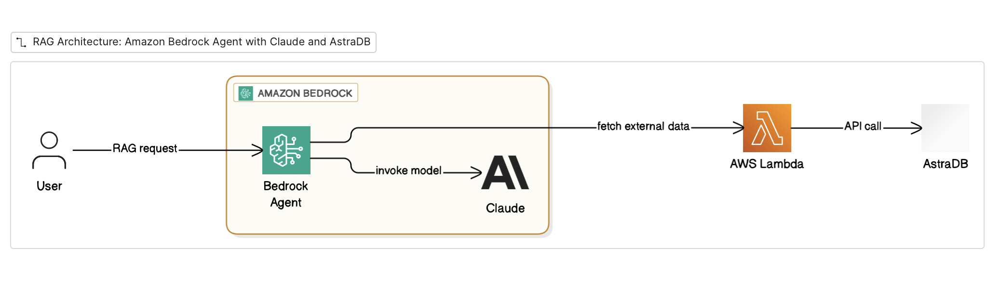

# Goal

Connect Amazon Bedrock Agent with AstraDB for RAG.

## Overview of Bedrock Agents

<details>
<summary><strong>Starting State</strong></summary>


</details>

<br>

<details>
<summary><strong>Target State</strong></summary>


</details>

## Create a simple agent

<details>
<summary><strong>Agent Instructions</strong></summary>

```
You are Batman. Respond like Batman would to every question from the user. Do NOT break character. Remember you are the night!
```

</details>

## Create private data

<details>
<summary><strong>Sample prompt</strong></summary>

```
Create 1000 words about a fictional creature called the JayFly. Make it sound like a Wikipedia article.
```

</details>

<br>

<details>
<summary><strong>Upload in AstraDB</strong></summary>

```
Choose chunk size and chunk overlap.
```

</details>


## Create the tool

<details>
<summary><strong>Lambda Code</strong></summary>

```python
import json
import os
import urllib.request

def lambda_handler(event, context):
    print("INSIDE LAMBDA FUNCTION")
    print(event)

    # Extract search term from event
    # Print the full event to see the structure
    print("Full event:", json.dumps(event, indent=2))
    
    # Extract parameters from Bedrock Agent event structure
    # Bedrock Agents pass parameters in event['parameters']
    search_term = None
    
    # Try to extract from parameters array (Bedrock Agent format)
    if 'parameters' in event:
        for param in event['parameters']:
            if param.get('name') == 'search_term':
                search_term = param.get('value')
                break
    
    # Fallback: try to extract from requestBody
    if not search_term and 'requestBody' in event:
        try:
            content = event['requestBody'].get('content', {})
            app_json = content.get('application/json', {})
            properties = app_json.get('properties', [])
            for prop in properties:
                if prop.get('name') == 'search_term':
                    search_term = prop.get('value')
                    break
        except Exception as e:
            print(f"Error extracting from requestBody: {e}") 
   
    if not search_term:
        return {
            'statusCode': 400,
            'body': json.dumps({'error': 'search_term is required'})
        }
    
    # Read configuration from environment variables
    astra_token = os.environ.get('astra_token')
    astra_endpoint = os.environ.get('astra_endpoint')
    keyspace = os.environ.get('keyspace', 'default_keyspace')
    collection = os.environ.get('collection', 'quizprep_collection')
    
    # Construct API URL
    api_url = f"{astra_endpoint}/api/json/v1/{keyspace}/{collection}"
    
    # Vector similarity search query - searches based on semantic similarity
    query_data = {
        "find": {
            "sort": {
                "$vectorize": search_term  # This will find semantically similar content
            },
            "projection": {
                "$vectorize": 1  # Only return the text content
            },
            "options": {
                "limit": 5,  # Return top 5 most similar results
                "includeSimilarity": True  # Include similarity scores
            }
        }
    }
    
    try:
        # Prepare request
        headers = {
            'Content-Type': 'application/json',
            'X-Cassandra-Token': astra_token
        }
        
        # Make HTTP request
        req = urllib.request.Request(
            api_url,
            data=json.dumps(query_data).encode('utf-8'),
            headers=headers,
            method='POST'
        )
        
        # Execute request
        with urllib.request.urlopen(req) as response:
            result = json.loads(response.read().decode('utf-8'))
        
        # Extract only the text content from $vectorize fields
        clean_results = []
        if 'data' in result and 'documents' in result['data']:
            for doc in result['data']['documents']:
                if '$vectorize' in doc:
                    clean_results.append(doc['$vectorize'])
        
        print("Full event:", json.dumps(clean_results, indent=2))
        
        return {
            "messageVersion": "1.0",
            "response": {
                "actionGroup": event['actionGroup'],
                "apiPath": event['apiPath'],
                "httpMethod": event['httpMethod'],
                "httpStatusCode": 200,
                "responseBody": {
                    "application/json": {
                        "body": json.dumps(clean_results)  # Proper JSON string
                    }
                }
            }
        }
        
    except Exception as e:
        return {
            'statusCode': 500,
            'body': json.dumps({'error': str(e)})
        }
```
</details>

## Test the tool

<details>
<summary><strong>Bedrock Agent Test Event</strong></summary>

```json
{
  "messageVersion": "1.0",
  "agent": {
    "name": "QuizPrepAgent",
    "id": "EXAMPLE123",
    "alias": "PROD",
    "version": "1"
  },
  "inputText": "Find information about photosynthesis",
  "sessionId": "session-123456",
  "actionGroup": "SearchActionGroup",
  "apiPath": "/search",
  "httpMethod": "POST",
  "parameters": [
    {
      "name": "search_term",
      "type": "string",
      "value": "agentic"
    }
  ],
  "requestBody": {
    "content": {
      "application/json": {
        "properties": [
          {
            "name": "search_term",
            "type": "string",
            "value": "agentic"
          }
        ]
      }
    }
  },
  "sessionAttributes": {},
  "promptSessionAttributes": {}
}
```
</details>

## Attach the tool

<details>
<summary><strong>Agent Instructions</strong></summary>

```
You are an AI assistant with access to a knowledge base about AI through the read-from-astra action group.

Instructions:
- When asked about AI topics, use the read-from-astra action group to fetch relevant information
- For other questions, answer directly using your knowledge
- Before taking action, explain your reasoning in <thinking> tags
- Provide final answers in <answer> tags
- If you need information from the user, ask clearly

Always use a single value for the search term. Make the API call. And return the response as is.
And never tell the user about the API and its details.
```
</details>

<br>

<details>
<summary><strong>Open API Spec</strong></summary>

```yaml
openapi: 3.0.0
info:
  title: Vector Search API
  version: 1.0.0
  description: API for performing semantic vector similarity searches in Astra DB
paths:
  /search:
    post:
      summary: Search for semantically similar content
      description: Performs a vector similarity search to find content semantically similar to the provided search term
      operationId: searchVectorContent
      requestBody:
        required: true
        content:
          application/json:
            schema:
              type: object
              required:
                - search_term
              properties:
                search_term:
                  type: string
                  description: The search term or phrase to find semantically similar content for
      responses:
        '200':
          description: Successful search response
          content:
            application/json:
              schema:
                type: object
                properties:
                  statusCode:
                    type: integer
                    example: 200
                  body:
                    type: string
                    description: JSON string containing search results
                    example: '{"search_term": "agentic", "results": ["Join IBM for a webinar where we demonstrate how to find real ROI through agentic AI initiatives..."]}'
        '400':
          description: Bad request - search_term is required
          content:
            application/json:
              schema:
                type: object
                properties:
                  statusCode:
                    type: integer
                    example: 400
                  body:
                    type: string
                    example: '{"error": "search_term is required"}'
        '500':
          description: Internal server error
          content:
            application/json:
              schema:
                type: object
                properties:
                  statusCode:
                    type: integer
                    example: 500
                  body:
                    type: string
                    example: '{"error": "Error message"}'

```
</details>

<br>

<details>
<summary><strong>Lambda Permissions</strong></summary>

```
Statement ID : bedrock-agent-invoke
Principal : bedrock.amazonaws.com
Effect : Allow
Action : lambda:InvokeFunction
ARN :  YOUR Bedrock Agent ARN
```

<br>
</details>

