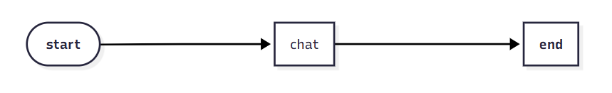
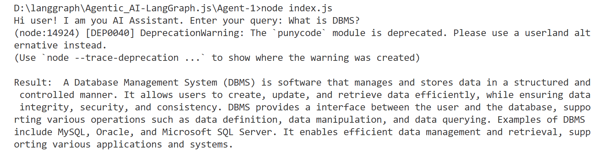
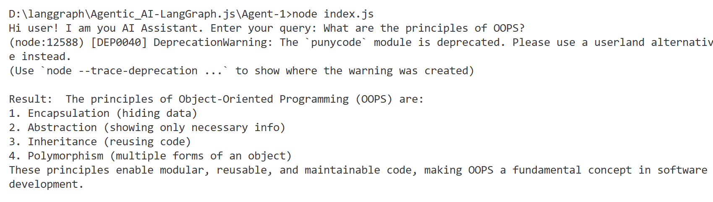

# Minimal AI Chat Agent

This project showcases a lightweight “Hello World”–style AI assistant built with [LangGraph](https://github.com/langchain-ai/langgraphjs), [LangChain.js](https://js.langchain.com/), and the [Groq](https://groq.com/) language model (`llama-3.3-70b-versatile`). It accepts user input through the terminal and returns concise, accurate responses generated by the LLM.

This project provides an excellent starting point for experimenting with graph-based AI logic, custom chat flows, or Groq-powered inference.

## Setup Instructions

### 1. Install dependencies
```bash
npm install
```

### 2. Create a .env file
Create a ```.env``` file in the root directory (or a copy of .env.example ) with your Groq API key:

```ini
GROQ_API_KEY="your_groq_api_key_here"
```
You can get a free API key from [Groq](https://console.groq.com).

### 3. Run the Assistant
```bash
node index.js
```
(Make sure you're using Node.js version 18 or above)

## Example Usage
Once started, you can chat with the assistant in your terminal:

```
User: What are the principles of OOPS?
AI: (whatever answer we get from LLM)
```


## Graph Structure

Here is the visual representation of the LangGraph workflow.



## Results

Here is a sample output from the terminal after interacting with the assistant:




