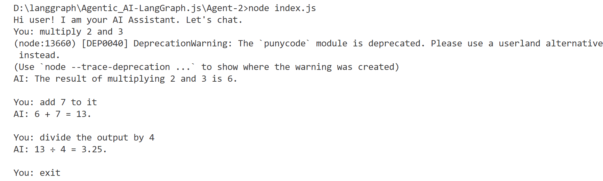
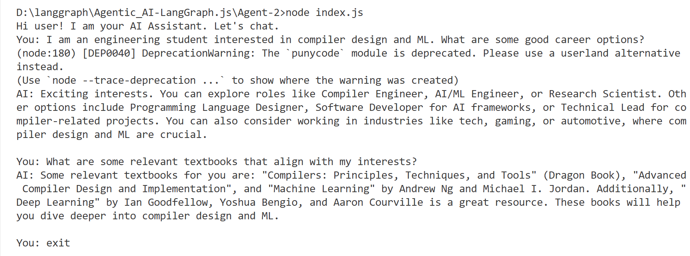

# 🤖 AI Chat Assistant using LangGraph, LangChain, and Groq

This project is a simple conversational AI assistant built using:

- 🧠  [LangGraph](https://github.com/langchain-ai/langgraphjs) for managing conversational flow using graphs

- 🔗 [LangChain](https://js.langchain.com/) for LLM integration and memory abstraction

- 🦙  [Groq](https://console.groq.com/) for ultra-fast inference with LLaMA 3 models

- 📝 BufferMemory – to persist conversation history across user turns

## 📦 Features
- Conversational memory (via ```BufferMemory```)

- Integration with Groq's ```meta-llama/llama-4-maverick-17b-128e-instruct``` model

- Prompt loop for continuous interaction

- Memory-aware responses (context retention)

- System prompt for consistent assistant behavior

- Clean LangGraph architecture with start → chat → end

## 🛠️ Setup Instructions

### 1. Clone this repository
 
```bash
git clone https://github.com/Mishty-G01/Agentic_AI-LangGraph.js.git
cd Agentic_AI-LangGraph.js
cd Agent-2
```

### 2. Install dependencies

```bash
npm install
```

### 3. Create ```.env``` file

```bash
touch .env
```

Add your Groq API key inside:

```ini
GROQ_API_KEY=your-groq-api-key-here
```
You can get your API key from: https://console.groq.com

### ▶️ Running the Assistant

```bash
node index.js
```
Then chat with the assistant.  Type exit to quit the conversation.

## 📁 Project Structure
```bash
.
├── assets            # output images
├── node_modules      # Installed npm dependencies
├── .env              # Environment variables (contains GROQ_API_KEY)
├── index.js          # Main code (LangGraph + memory)
├── package-lock.json      # Project metadata and dependencies 
├── package.json       # Exact versions of installed packages
└── README.md          # Project documentation
```
## 🧠 How Memory Works (Step-by-Step)

We use ```BufferMemory``` to keep track of the entire conversation so the AI assistant can generate context-aware responses. Here’s how it works:

create a ```BufferMemory``` instance
- Load memory → get history
- Build new message list: ```SystemMessage``` + history + ```HumanMessage```
- Call the LLM
- Save the interaction (input, output) into memory

    
    This is repeated for every message you send

## 🖼️ Example Result

Here is a sample output from the terminal after interacting with the assistant:





The agent remembers the previous state/chat while responding to current query. 