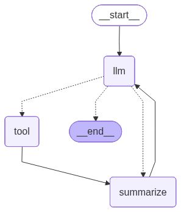
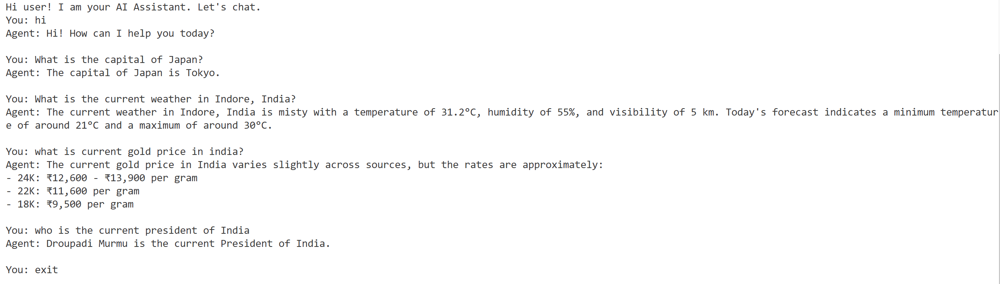

# 🧠 LangGraph + Groq + Tavily AI Assistant

This project is an **AI-powered conversational assistant** built with [LangGraph](https://langchain-ai.github.io/langgraphjs/), [Groq](https://groq.com), and [Tavily](https://tavily.com). It supports **real-time web search** via Tavily, **conversation history** with LangChain’s `ChatMessageHistory`, and **summarization** of search results.

The assistant:
- Responds to general knowledge and greetings directly.
- Calls the **Tavily Search Tool** when a query requires **current or real-time information**.
- Summarizes search results before giving you a final answer.
- Remembers context across turns during a session.


## ⚙️ Features
- 🌐 **Real-time search** with Tavily
- 🦙 **LLM reasoning** powered by Groq’s `meta-llama/llama-4-maverick-17b-128e-instruct`
- 🧩 **Graph workflow** using LangGraph
- 💾 **Session memory** with `ChatMessageHistory`
- ✨ **Summarization** of search results for concise answers
- 🔄 **Looped interaction** until the user exits


## 📦 Tech Stack
- **Node.js** (JavaScript)
- **LangGraph** – workflow orchestration
- **Groq API** – LLM backend
- **Tavily API** – real-time search
- **Zod** – schema validation
- **prompt-sync** – CLI input
- **dotenv** – environment variable management


## 📊 Graph Structure

Here is the visual representation of the LangGraph workflow.




## 🚀 Getting Started

### 1. Clone this repo
```bash
git clone https://github.com/Mishty-G01/Agentic_AI-LangGraph.js.git
cd Agentic_AI-LangGraph.js
cd Agent-3
```

### 2. Install dependencies

```bash
npm install
```

### 3. Set up environment variables
Create ```.env``` file in root directory:
```bash
touch .env
```
Add your API keys inside it.

```bash
GROQ_API_KEY=your_groq_api_key_here
TAVILY_API_KEY=your_tavily_api_key_here
```

### 4. Running the Assistant

```bash
node index.js
```
Then chat with your assistant.  Type exit to quit the conversation.

## 💬 Usage

Once started, you can chat with the assistant in your terminal:

```
Hi user! I am your AI Assistant. Let's chat.
You: What is the capital of Japan?
Agent: The capital of Japan is Tokyo. 

You: What’s the latest news about AI chips?
Agent: [Summarized real-time info...]
```

To exit:
```
You: exit
```

## 🗂 Project Structure
```bash
├── assets
│   └── image.png    # Example result screenshot
├── node_modules      # Installed npm dependencies
├── .env            # Environment variables (contains API keys)
├── graph.png       # Visual representation of the LangGraph workflow
├── index.js        # Main entry file with graph and agent loop
├── package-lock.json     # Project metadata and dependencies 
├── package.json   `# Exact versions of installed packages
└── README.md       # Project documentation

```
## 🔑 API Keys

Groq: Get your API key from [Groq Console](https://console.groq.com/home).\
Tavily: Get your API key from [Tavily Dashboard](https://app.tavily.com/home).


## 🖼️ Example Result

Here is a sample output from the terminal after interacting with the assistant:


