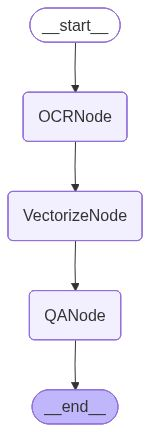
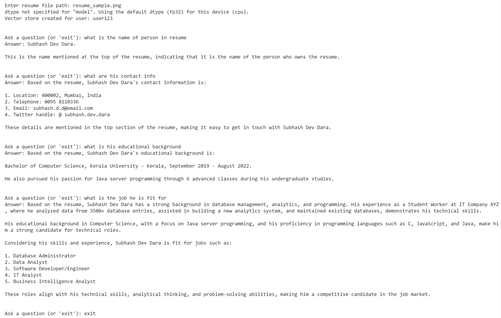

# AI Agent for Document-Based Question Answering

This project is an AI-driven document question-answering agent that uses **Optical Character Recognition (OCR)** to extract text from images, stores the content in a **vector database (ChromaDB)**, and ask **natural language queries** about its content using a **large language model (Groq Llama 4 Maverick series model)**. 

## Features 
- **RAG Pipeline**: Implements a Retrieval-Augmented Generation workflow. 
- **OCR Integration**: Extracts text from any scanned or photographed image-based document using [Tesseract.js](https://tesseract.projectnaptha.com/), enabling support for resumes, forms, receipts, notes, certificates, reference material and more.
- **Vectorization & Storage**: Creates embeddings with [Hugging Face sentence-transformers](https://huggingface.co/sentence-transformers/all-MiniLM-L6-v2) and stores them in a [Chroma](https://www.trychroma.com/) vector store. 
- **Fast LLM Inference**: Powered by [Groq's meta-llama/llama-4-maverick-17b-128e-instruct](https://console.groq.com/docs/model/meta-llama/llama-4-maverick-17b-128e-instruct) for quick, intelligent responses. 
- **Conversational Q&A**: Allows you to ask multiple questions about the image document in a single session. 

## Getting Started
### 1. Prerequisites 
Before starting, ensure you have the following installed: 
- [Node.js (v18+)](https://nodejs.org/) 
- [Docker Desktop](https://www.docker.com/products/docker-desktop) 

> **Important:** 
> Before running any Docker command, make sure **Docker Desktop is open and running**. 
--- 

### 2. Install dependencies
```bash
npm install
```
---

### 3. Environment Variables 
Create a ```.env``` file in the root folder and add your Groq API key:
```bash
GROQ_API_KEY=your_groq_api_key_here
```
Get your API key here: https://console.groq.com/keys 

### 4. Running Chroma Database 
This project uses ChromaDB, a lightweight open-source vector database. 
To run it locally using Docker:
```bash
# Step 1: Make sure Docker Desktop is open
# Step 2: Pull Chroma image
docker pull chromadb/chroma
```
```bash
# Step 3: Run Chroma container
docker run -p 8000:8000 chromadb/chroma
```
Reference: [ChromaDB integration with LangChain](https://js.langchain.com/docs/integrations/vectorstores/chroma/) 

### 5. Running the Project 
In a separate terminal, start the Node.js app:
```bash
node index.js
```
You’ll be prompted to enter file path:
```bash
Enter file path: resume_sample.png
```
Then you can start asking questions interactively, like:
```bash
Ask a question (or 'exit'): What is the candidate's name?
Answer: (based on the resume - the ans should be provided)
```
## Libraries and Tools Used 
| Library / Tool | Purpose | Official Reference | 
|----------------|----------|--------------------| 
| **@langchain/langgraph** | Enables graph-based workflows in LangChain. It connects logical components like OCR, vectorization, and Q&A nodes, and can generate a visual graph (graph.png) of the pipeline. | [LangGraph Docs](https://js.langchain.com/docs/langgraph) | 
| **@langchain/groq** | Integrates **Groq’s high-speed LLMs** (like Meta Llama 4 Maverick 17B) with LangChain to perform question answering and reasoning. | [LangChain Groq Integration](https://js.langchain.com/docs/integrations/chat/groq/) | 
| **@langchain/community/vectorstores/chroma** | Provides integration between LangChain and **ChromaDB**, allowing storage and retrieval of document embeddings for semantic search. | [Chroma Vector Store Integration](https://js.langchain.com/docs/integrations/vectorstores/chroma) | 
| **@langchain/community/embeddings/huggingface_transformers** | Generates vector embeddings for text using **Hugging Face Transformers**, specifically the all-MiniLM-L6-v2 sentence transformer model. | [Hugging Face Model Page](https://huggingface.co/sentence-transformers/all-MiniLM-L6-v2) | 
| **langchain/stores/message/in_memory** | Handles **in-memory chat history** for LangChain conversations, maintaining dialogue context between the user and the LLM. | [LangChain Memory Docs](https://v03.api.js.langchain.com/modules/_langchain_community.stores_message_in_memory.html)| 
| **tesseract.js** | Performs **Optical Character Recognition (OCR)** on image-based documents, extracting text for further processing. | [Tesseract.js GitHub](https://github.com/naptha/tesseract.js) | 
| **dotenv** | Loads environment variables (like API keys) securely from a .env file into process.env. | [dotenv npm](https://www.npmjs.com/package/dotenv) | 
| **Docker Desktop** | Required to run **ChromaDB** locally inside a container. It must be started before running any Docker commands. | [Docker Desktop](https://www.docker.com/products/docker-desktop) | 
| **ChromaDB** | An open-source **vector database** used to store and retrieve text embeddings for RAG pipelines. Runs locally via Docker. | [ChromaDB Docs](https://docs.trychroma.com/) | 
| **Groq LLM API** | Provides access to **Groq’s ultra-fast inference servers** for Llama-based large language models. Used here for natural language Q&A. | [Groq API Console](https://console.groq.com/) | 
--- 
## Workflow Summary
Here is the visual representation of the LangGraph workflow.



- User Input → provide document path. 
- OCRNode → extracts text using tesseract.js. 
- VectorizeNode → splits text into chunks, embeds using HuggingFace, and stores in Chroma. 
- QANode → retrieves relevant chunks via similarity search and answers questions using Groq LLM. 
- Chat History → conversation maintained across queries. 
 
## Example Result 
Here is a sample output from the terminal after interacting with the assistant: 

