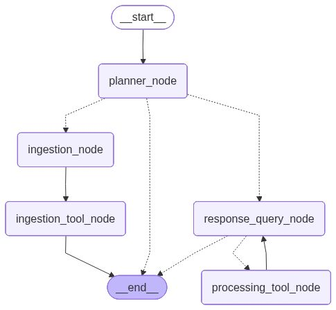
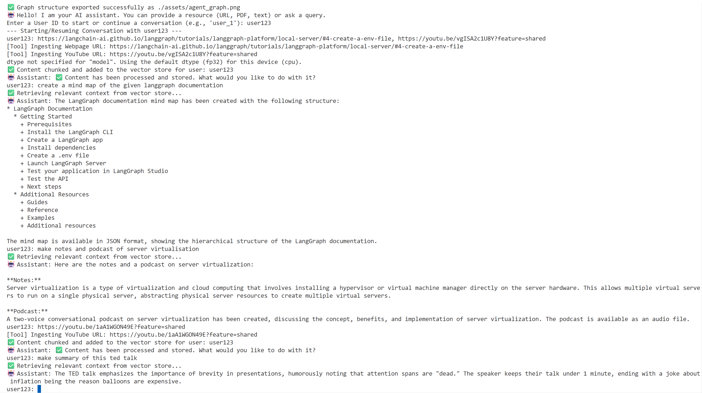
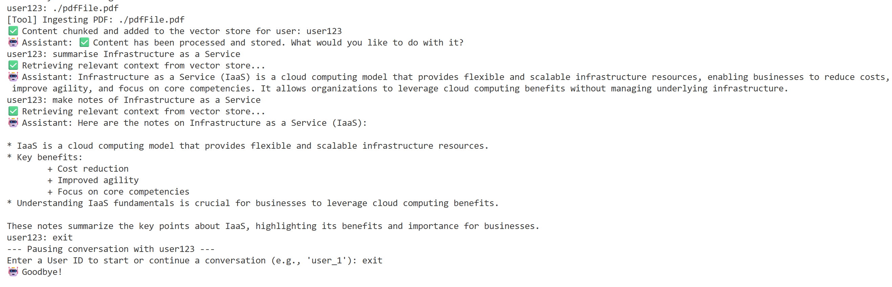

# Google NotebookLM mimic

This agent is a **multi-tool AI agent** that can **ingest, store, and process knowledge** from multiple sources (like PDFs, YouTube videos, web pages and raw text) and then **answer questions or perform higher-level tasks** like summarization, note-taking, mind-map creation, or podcast generation.

It combines **LangChain + LangGraph + Groq LLMs + ChromaDB + Hugging Face Embeddings + Google TTS** to form an end-to-end **Retrieval-Augmented Generation (RAG)** system with integrated reasoning and tool usage.


## Features

- **Multi-source Ingestion:** Load data from **YouTube**, **PDFs**, **webpages**, or direct **text input**.
- **Vector Store Integration:** Uses **ChromaDB** to store embeddings for efficient semantic retrieval.
- **Intelligent Routing:** Automatically classifies user input as a *resource*, *query*, or *exit* using an LLM planner.
- **Conversational Memory:** Maintains multi-turn chat state per user session.
- **Processing Tools:**
  - **Mind Map Generation** (produces structured JSON mindmaps)
  - **Note Creation** (concise bullet points)
  - **Podcast Generation** (two-voice MP3 audio with Google Cloud Text-To-Speech)
  - **Summarization** (summarizes text)
- **RAG-Enhanced Query Answering:** Combines contextual retrieval with LLM reasoning for precise answers.


## Project Architecture
```bash
├── tools/
    ├── ingestion_tools.js # Tools for loading resources (YouTube, PDF, webpages, text)
    └── processing_tools.js # Tools for processing and generating output (notes, podcasts, mindmap and summary)
├── .env # Stores Groq API key
├── gcp-tts.json # Google Cloud TTS API credentials (required for podcast tool)
├── index.js # Main agent orchestration file (LangGraph workflow)
├── package-lock.json # Auto-generated dependency tree
├── package.json # Project metadata and dependencies 
├── GCP_TTS_setup.md # Guide for setting up Google Cloud TTS
└── README.md # Project documentation
```


## Getting Started

### 1. Prerequisites

Make sure the following are installed on your system:

- [Node.js (v18+)](https://nodejs.org/)
- [Docker Desktop](https://www.docker.com/products/docker-desktop)
- (Optional) [Google Cloud SDK](https://cloud.google.com/text-to-speech/docs/reference/libraries) if you plan to use the podcast generation feature.

> **Important:**  
> Before running any Docker command, ensure **Docker Desktop is open and running**, otherwise the container will not start.

---

### 2. Install dependencies

```
npm install
```
---
### 3. Environment Variables

Create a ```.env``` file in the root directory and add your Groq API key:
```bash
GROQ_API_KEY=your_groq_api_key_here
```

Generate a key from: [https://console.groq.com/keys](https://console.groq.com/keys)

If using the Podcast Tool, also include your Google Cloud Text-to-Speech credentials file:
For detailed instructions on setting this up, see:
[GCP_TTS_setup.md](./GCP_TTS_setup.md)

---
### 4. Running Chroma Database

This agent uses ChromaDB as its local vector store for knowledge retrieval.
Run it using Docker:

```bash
# Step 1: Make sure Docker Desktop is open
# Step 2: Pull Chroma image
docker pull chromadb/chroma
```

```bash
# Step 3: Run Chroma container
docker run -p 8000:8000 chromadb/chroma
```

Reference: [ChromaDB integration with LangChain](https://js.langchain.com/docs/integrations/vectorstores/chroma/)

---
### 5. Running the Agent

Once Chroma is running, open a new terminal and run:
```bash
node index.js
```

## Libraries and Tools Used

| Library / Tool | Purpose | Official Reference |
|----------------|----------|--------------------|
| **@langchain/community/vectorstores/chroma** | Provides integration between LangChain and **ChromaDB**, allowing storage and retrieval of document embeddings for semantic search. | [Chroma Vector Store Integration](https://js.langchain.com/docs/integrations/vectorstores/chroma) |
| **@langchain/community/embeddings/huggingface_transformers** | Generates embeddings using **Hugging Face Transformers**, specifically ```sentence-transformers/all-MiniLM-L6-v2.``` | [Hugging Face Model Page](https://huggingface.co/sentence-transformers/all-MiniLM-L6-v2) |
| **langchain/text_splitter** (`RecursiveCharacterTextSplitter`) | Splits large text into smaller overlapping chunks for efficient embedding and retrieval. | [Text Splitter Docs](https://docs.langchain.com/oss/python/integrations/splitters) |
| **@langchain/core/documents** (`Document`) | Represents structured text data (content + metadata) that can be stored in a vector database. | [Document Class Docs](https://v03.api.js.langchain.com/classes/_langchain_core.documents.Document.html) |
| **@langchain/community/document_loaders** | Loads data from different content sources like YouTube, PDFs, and web pages. | [Document Loaders Docs](https://js.langchain.com/docs/integrations/document_loaders/) |
| **@google-cloud/text-to-speech** | Converts generated podcast scripts into audio MP3s using Google Cloud TTS. | [Google Cloud TTS Docs](https://cloud.google.com/text-to-speech/docs) |
| **zod** | Schema validation for tool arguments and user input. | [Zod Docs](https://zod.dev/) |
| **fs (Node.js File System)** | Reads and writes files such as `mind_map.txt`, `podcast_episode_two_voice.mp3`, and `agent_graph.png`. | [Node.js fs Docs](https://nodejs.org/api/fs.html) |
| **Docker Desktop** | Required to run **ChromaDB** locally inside a container. It must be started before running any Docker commands. | [Docker Desktop](https://www.docker.com/products/docker-desktop) |
| **ChromaDB** | An open-source **vector database** used to store and retrieve text embeddings for RAG pipelines. Runs locally via Docker. | [ChromaDB Docs](https://docs.trychroma.com/) |

---
## Workflow Summary


> The workflow visualization (`agent_graph.png`) is generated using LangGraph’s internal JavaScript API (getGraphAsync() and drawMermaidPng()).
> You can regenerate it anytime by calling `exportGraphImage(app, "./assets/agent_graph.png")` after compiling your graph.


- Planner Node  → Classifies input as resource / query / exit           
- Ingestion Node → Uses ingestion tools to process PDFs/URLs/text
- Ingestion Tool Node → Splits & stores text into Chroma vector DB
- Response Query Node → Retrieves context and answers or invokes tools
- Processing Tool Node → Summarize / Notes / Mind Map creation / Podcast generation

## Example Result

Here is a sample output from the terminal after interacting with the assistant:





The agent supports parallel execution, allowing it to ingest multiple resources and run several processing tools simultaneously.