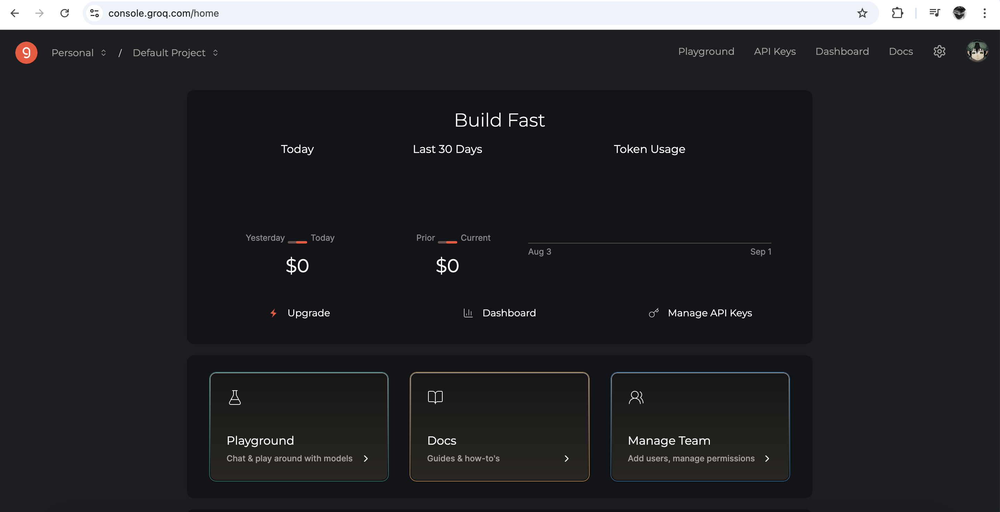
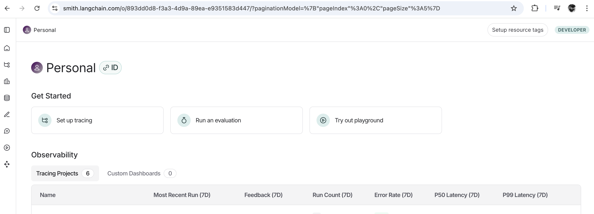
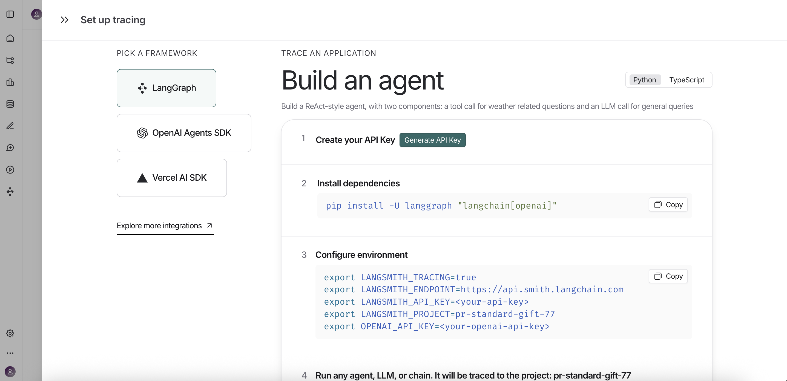
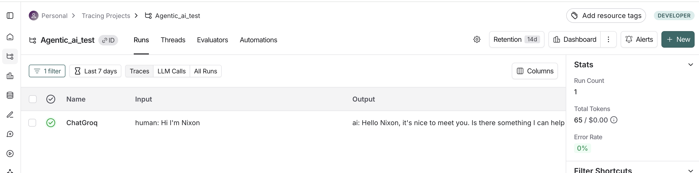
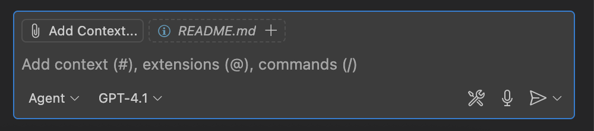
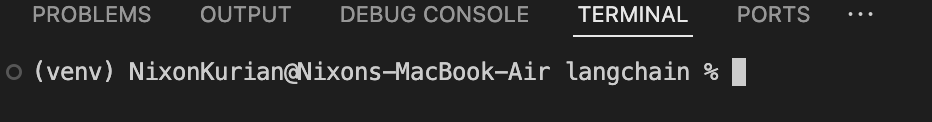

# GUIDELINES

## Setup of VSCode, Git, Python, GitHub Copilot
Go checkout this [setup guide](https://gist.github.com/Khushu308/b65b03f99cbf5999bf4ee9f3fcdde546) for setting VSCode, Git, Python and GitHub Copilot (installing and sign in).

---

### Generating Groq API keys
1. Sign-up for a Groq Cloud account - [console.groq.com](https://console.groq.com/home)
2. Log in to the groq console. 

3. On the right side navigation panel, click on API Keys
4. Click on Create API Key, give a name and generate the API key.
5. Make sure to save/store the API Key somewhere safe, cause you won't be able to copy or view the api key after that.
6. It'll give you the entire env variables with value copy and paste it in your .env file. 

> To know the available models and details about them checkout - [model docs](https://console.groq.com/docs/models)

### Generating Langsmith API keys
1. Sign-up for a Langsmith account - [langsmith.com](https://smith.langchain.com/)
2. Log in to the langsmith.

3. Click on `Set up tracing`
4. Click on `generate api key` and copy configure environment section.

5. Create a .env file (if it's not already present), this should be present in the root of your project folder.
6. Paste the configure environment variables that you copied in step 4, without the `export` keyword. Also remove the `OPENAI_API_KEY` variable in the .env (only use when you have a key from OpenAI). So what you paste in your .env file will look somewhat similar to what's shown below:
```bash
LANGSMITH_TRACING=true
LANGSMITH_ENDPOINT=https://api.smith.langchain.com
LANGSMITH_API_KEY=lsv2_pt_505038....
LANGSMITH_PROJECT=pr-standard-gift-77
```

### To start viewing the traces

Now you can run your python script, just make sure after pasting you kill all the terminal and start the terminal. Run the python script, once you get the llm response. 
You can go back to langsmith console, 
- under the tracing projects 
- select the project for which you saved in .env 
- you'll be able to see the llm call made and the response



---

### Validation Steps & Troubleshooting

#### 1. VSCode
**Validation Command:**
```sh
code --version
```
**Success:** Shows VSCode version.
**If Error:**
- Ensure VSCode is installed.
- If `code` is not found, add VSCode to your PATH (see Command Palette > "Shell Command: Install 'code' command in PATH").

#### 2. Git
**Validation Command:**
```sh
git --version
```
**Success:** Shows Git version.
**If Error:**
- Install Git from [git-scm.com](https://git-scm.com/).
- If installed but not found, check your PATH variable.

#### 3. Python
**Validation Command:**
```sh
python --version
```
or
```sh
python3 --version
```
**Success:** Shows Python version (preferably 3.x).
**If Error:**
- Download and install Python from [python.org](https://www.python.org/).
- If wrong version, update Python.
- If not found, check your PATH variable.

#### 4. GitHub Copilot
**Validation Steps:**
- In VSCode, go to Extensions and search for "GitHub Copilot".
- Ensure it is installed and enabled.
- Sign in with your GitHub account.

**Validation Command:**
- Open the Copilot Chat panel (View > Copilot > Chat).
- Send a sample query, such as:
	```
	How do I write a Python function to add two numbers?
	```
- If Copilot responds with a code suggestion or answer, it is working.

**If Error:**
- Make sure you are signed in to GitHub.
- Check your internet connection.
- If extension is missing, install from VSCode Extensions Marketplace.
- If chat panel does not respond, reload VSCode or reinstall the extension.

---

## Step-by-Step Project Setup for Beginners (Windows-first, Mac/Linux in brackets)

### 1. Create a Folder for Your Project
1. Right-click on your Desktop or in File Explorer and choose **New > Folder**.
2. Name it (e.g., `my_python_project`).
3. Open this folder.

### 2. Open VSCode and Select Your Project Folder
1. Open VSCode from your Start Menu.
2. Click **File > Open Folder...**
3. Select your project folder and click **Select Folder**.
	*(Mac: VSCode > File > Open...)*
4. You should see your folder name in the VSCode sidebar.

### 3. Verify GitHub Copilot (GHCP) is Working
1. In VSCode, click **View > Copilot > Chat**.
2. In the chat panel, type a question (e.g., "How do I write a Python function to add two numbers?") and press Enter.
3. If Copilot responds, it's working.
	- If not, check you are signed in to GitHub and Copilot is installed (see Extensions sidebar).

### 4. Switch to Agent Mode 
1. In Copilot Chat panel, below the input box you'll see a drop down that'll have one of the following written - "Ask", "Agent", "Edits". You can click on the drop-down and select "Agent" if it's not already in that mode 
OR 
You can use keyboard shortcuts `Ctrl + Shift + I` (for Mac: `Command + Shift + I`) to open GHCP in Agent mode.
2. Look for a message or indicator that agent mode is active. Check the screenshot below:



#### Set default terminal to git bash
1. `Ctrl + Shift + P` and then type `Terminal: Select Default Profile` as you type it'll suggest the command. Click on it.
2. You'll be able to see all the terminal you can use - `git bash`, `cmd`, `powershell`, etc. 
3. Set `git bash` as your default terminal.

### 5. Prompt GHCP Agent Mode to create simple langchain application
1. In Copilot Chat (Agent Mode), describe what you want your Python app to do.
2. Sample Prompt:
```
Create a simple python terminal application that has a chat based (user query and response) flow using langchain and langchain-groq library for building this application. 
The api keys for llm and model name should come from a config file, use dotenv where needed to load the env variables.
Create requirements.txt file with the libraries needed for the application
```
3. Copilot will suggest code file, config and a `requirements.txt` file. 
> Note: This is based on above prompt, files or structure can be different

**Prompting guideline**
- Always write clear and specific instructions with all required context.
- In case of complex use case, break down the task and prompt one task at a time.
- You can also feed the errors to ghcp to fix the errors.

In case you are stuck or not getting the right response. You can checkout the code and config file in the Langchain folder - 
- [chat_terminal.py](chat_terminal.py)
- [config.py](config.py)
- [requiremets.txt](requirements.txt)

### 6. Create a Python Virtual Environment (venv)
1. In VSCode, open a new terminal (**View > Terminal**).
2. Type:
	```
	python -m venv venv
	```
	*(Mac/Linux: use `python3 -m venv venv`)*
3. You should see a new folder called `venv` in your project.

### 7. Activate the Virtual Environment
1. In the terminal (git bash), type:
	```
	source venv\Scripts\activate
	```

    Cmd - 
    ```
    venv\Scripts\activate
    ```

    Powershell - 
    ```
    venv\Scripts\Activate.ps1
    ```
	*(Mac/Linux: `source venv/bin/activate`)*
2. Your terminal prompt should now start with `(venv)`.



### 8. Install Required Libraries from requirements.txt
1. Make sure `requirements.txt` is in your project folder. And in terminal as well you are in your project folder path. Type `pwd` in the terminal to verify, you are in the root folder inside which the `requirements.txt` file is present.
2. In the terminal, type:
	```
	pip install -r requirements.txt
	```
	*(Mac/Linux: use `pip3` if needed)*

    Alternatively, you can install single packages or libraries using - 
    ```
    pip install packageName
    ```
    in place of `packageName` the actual name of the package should be present. 
    
    
    > Note: You can find packages from [pypi website](https://pypi.org/), or in your browser type the package name and add pypi the first result should take you to the right place. You can copy paste the intall command directly from the site.
3. You should see messages that packages are being installed.
4. To check, type:
	```
	pip list
	```
	*(Mac/Linux: use `pip3 list`)*

### 9. Set Python Interpreter in VSCode
1. In VSCode, press `Ctrl+Shift+P` (Mac: `Cmd+Shift+P`).
2. Type `Python: Select Interpreter` and select it.
3. Choose the interpreter that shows your project folder and `venv`.
4. You should see the selected interpreter at the bottom left of VSCode.

### 10. Run Your Python Application
1. In VSCode, open your main Python file (e.g., `main.py`).
2. Click the green **Run** button at the top right, or right-click in the editor and choose **Run Python File in Terminal**.
3. You should see the output in the terminal below.
4. If there are errors, check the terminal messages for hints.

### 11. Troubleshooting
1. In case you run into some issues, examine the error message and try to troubleshoot.
2. If that doesn't work, tap in your trusty sidekick - [Claude.ai](https://claude.ai/new)
3. Enter a prompt like this
```
Debug issues in my code

## My code
{Paste your code here - don't put in apikeys/secrets though}


## Error in terminal
{Paste the actual error from terminal/command prompt here}
```
4. Try out the recommendations from Claude.

---

## Objective

The main objective is for you to be able to send a request to the llm in the form of generic questions and you are able to get responses on your terminal, and also to check how it gets traced on langsmith to gain insights and metrics on your application.

### Sample qns to verify output

Note: The qn and response should also be present in your langsmith project configured.

1. What's the capital of India?
Ans. Capital of India is Delhi 

2. Explain OOPs concepts?
Ans. **Object-Oriented Programming (OOP) Concepts**
==============================================

Object-Oriented Programming (OOP) is a programming paradigm that revolves around the concept of objects and classes. It provides a way to design, organize, and structure code in a modular and reusable manner.
....


> Please note: if you ask qns based on realtime eg. `What's the time now?` or `what's the weather in Pune?`.
> You'll get incorrect responses since the LLM's have a knowledge cutoff date, it can only respond based on the data it was trained on.


