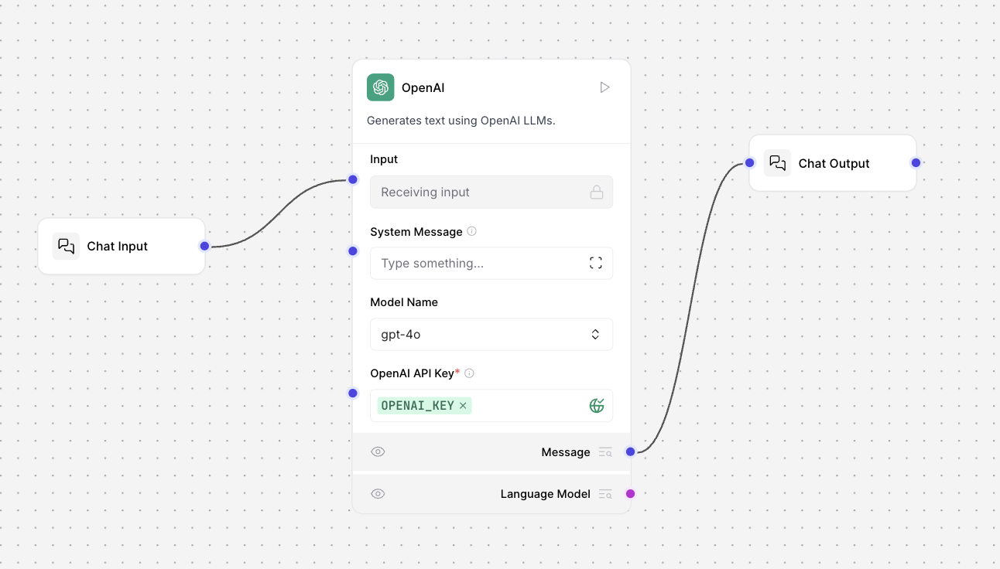

# Basic LLM Component (Langflow)

## Overview
This flow demonstrates a minimal, modular LLM agent pipeline in Langflow, designed to showcase the core building blocks of a conversational AI system. The flow is defined in the `Basic LLM component.json` file and visually represented in the diagram below.

## Flow Structure
The flow consists of three main components:

1. **Chat Input**
   - Collects user input from the playground interface.
   - Supports advanced options like sender type, session ID, file attachments, and message metadata (background color, icon, etc).
   - Produces a `Message` object as output.

2. **Model Component (OpenAI)**
   - Receives the `Message` from the Chat Input.
   - Connects to OpenAI's LLMs (e.g., GPT-4o, GPT-3.5-turbo) using an API key.
   - Configurable parameters: model name, temperature, max tokens, system message, streaming, and more.
   - Returns a `Message` object containing the LLM's response.
   - Instead of OpenAI component it can also be other providers present in Langflow.

3. **Chat Output**
   - Takes the LLM's response and displays it in the playground.
   - Handles formatting, sender metadata, and optional message storage.

## How It Works
- **User Message**: The user enters a prompt in the Chat Input component.
- **LLM Processing**: The message is sent to the OpenAI Model, which generates a response using the selected LLM.
- **Display**: The response is passed to the Chat Output component, which renders it in the UI.

## Key Features
- **Modularity**: Each component is independent and reusable.
- **Configurability**: Easily switch LLM providers or adjust parameters.
- **Extensibility**: Add more nodes (e.g., memory, tools, RAG) to build advanced agents.

## Example Use Case
This flow is ideal for:
- Prototyping simple chatbots
- Educational demonstrations of LLM agent architecture
- Serving as a template for more complex agentic workflows

## Output
The output after trying it on the playground.

