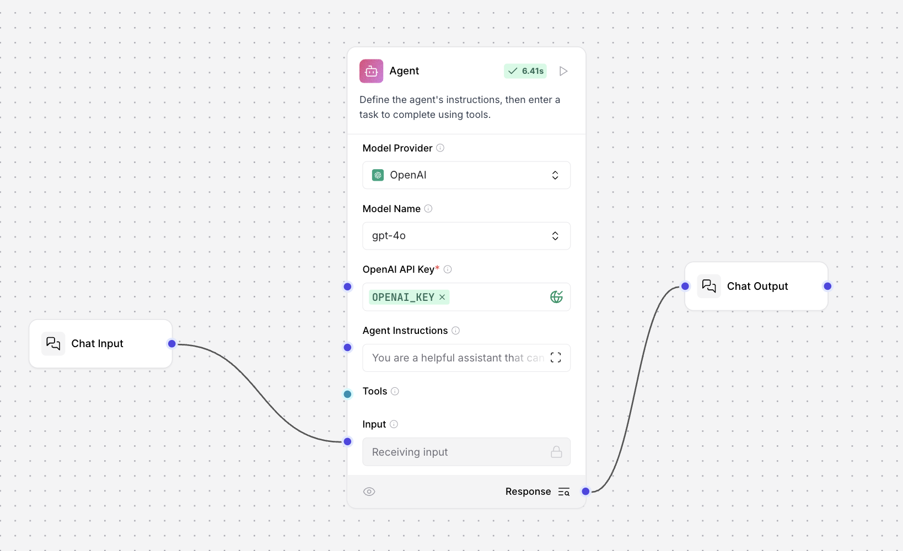
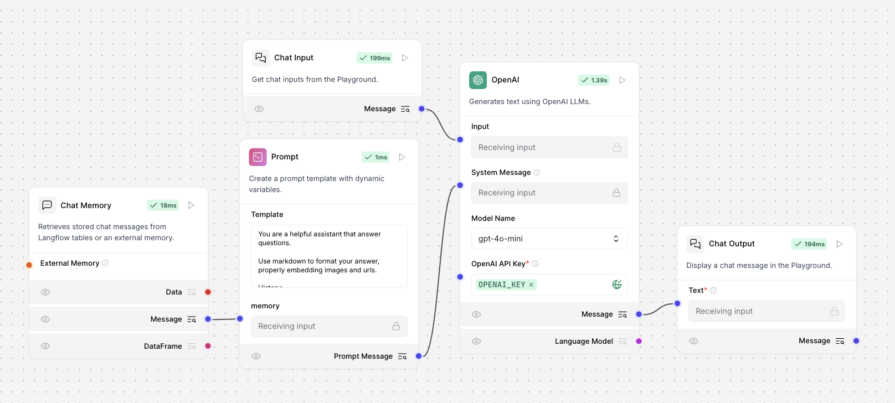
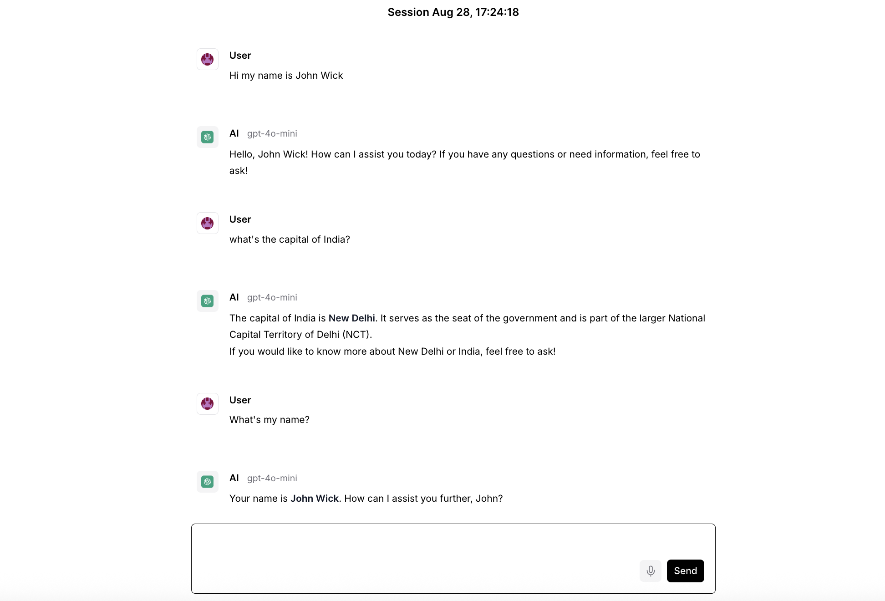

# Level 2: LLM with Memory (Langflow)

This level demonstrates two approaches to building a chatbot that can remember previous conversation turns using Langflow:

## 1. Agent Component (with Built-in Memory)

**Flow File:** `Agent Component.json`

**Diagram:**

### Overview
- Uses the **Agent** node, which internally manages conversation memory.
- The user message is passed from **Chat Input** to **Agent**, and the response is sent to **Chat Output**.
- No explicit memory node is required—the agent handles context tracking automatically.

**Typical Use Case:**
> When you want a simple, plug-and-play agent that can remember previous messages without extra configuration.

---

## 2. LLM with Explicit Memory Component

**Flow File:** `Memory Chatbot.json`

**Diagram:**

### Overview
- Adds a **Memory** node to explicitly store and retrieve conversation history.
- The **Memory** node connects to a **Prompt** node, which injects the conversation history into the system prompt for the LLM.
- The **OpenAI** node receives both the user input and the memory-augmented prompt, then outputs to **Chat Output**.

**Typical Use Case:**
> When you need fine-grained control over how memory is managed, or want to customize how previous messages are formatted and injected into the prompt.

---

## Output Example

---

### Summary
Both approaches enable persistent conversation context by making use of memory, which is an important factor when building Agentic AI systems.
