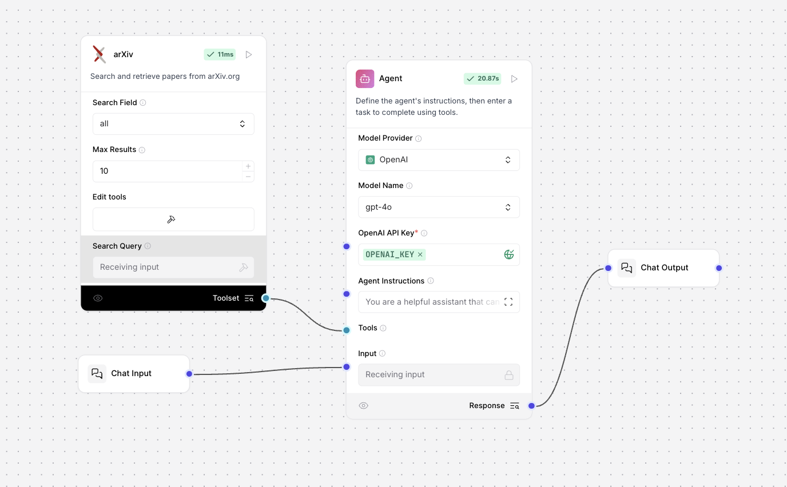
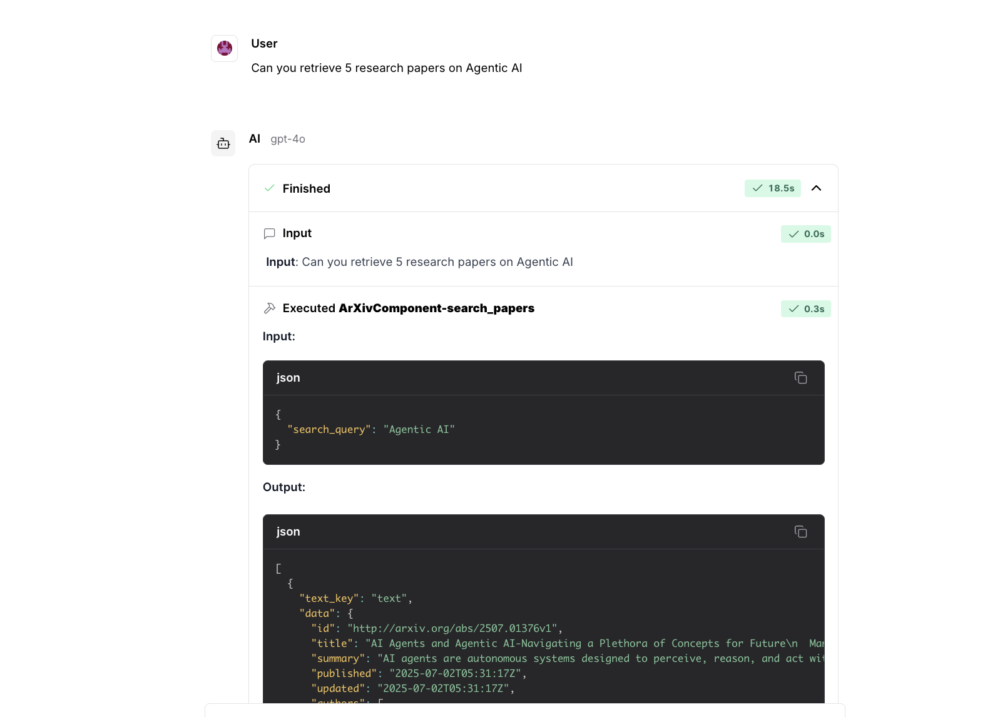

# Level 3: Agent with Tool (Langflow)

This level demonstrates how to build an agent that can use external tools to enhance its capabilities, using Langflow.

## Flow Overview

**Flow File:** `Agent with tool.json`

**Diagram:**

### Structure
- **Chat Input:** Collects user messages.
- **Agent:** Receives user input and is configured with one or more tools (e.g., ArXiv search, web search, calculators, etc.).
- **Tool Node (e.g., ArXivComponent):** Provides the agent with access to an external capability. In this example, the agent can search academic papers via ArXiv.
- **Chat Output:** Displays the agent's response, which may include information retrieved using the tool.

## How It Works
1. The user enters a query in the Chat Input.
2. The Agent determines if a tool is needed to answer the query.
3. If required, the Agent invokes the tool (e.g., ArXiv search) and incorporates the result into its response.
4. The final answer is shown in the Chat Output.

## Example Use Cases
- Academic research assistants (searching papers, summarizing findings)
- Agents that can access APIs, perform calculations, or retrieve real-time data
- Extending LLMs with custom or domain-specific tools

## Output Examples

**Sample Outputs:**

## Key Points
- **Tool Integration:** Tools are passed to the agent as separate nodes and can be swapped or extended easily.
- **Agent Reasoning:** The agent decides when and how to use tools, making it more powerful than a plain LLM.
- **Modularity:** This pattern can be extended to multiple tools for more complex workflows.

---

**Summary:**
This flow is a foundation for building agents that can interact with the outside world, making them more useful and context-aware than standalone LLMs.
