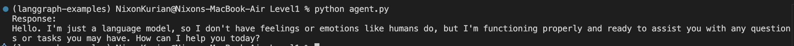

# Level 1: Simple LLM Call with LangGraph

This example demonstrates how to make a simple call to a Large Language Model (LLM) using the [LangGraph](https://github.com/langchain-ai/langgraph) library.

## Overview
- The code in `agent.py` sets up a minimal LangGraph workflow to send a prompt to an LLM and receive a response.
- This is a foundational example to help you understand how to use LangGraph for basic LLM interactions.

## How it works
1. The user provides an input prompt.
2. The prompt is sent to the LLM using LangGraph's graph execution.
3. The LLM's response is returned and displayed.

## Output
The result of running the code is shown below:

The image above shows a sample output generated by the LLM in response to a user prompt.

---
For more details, see the code in `agent.py`.
