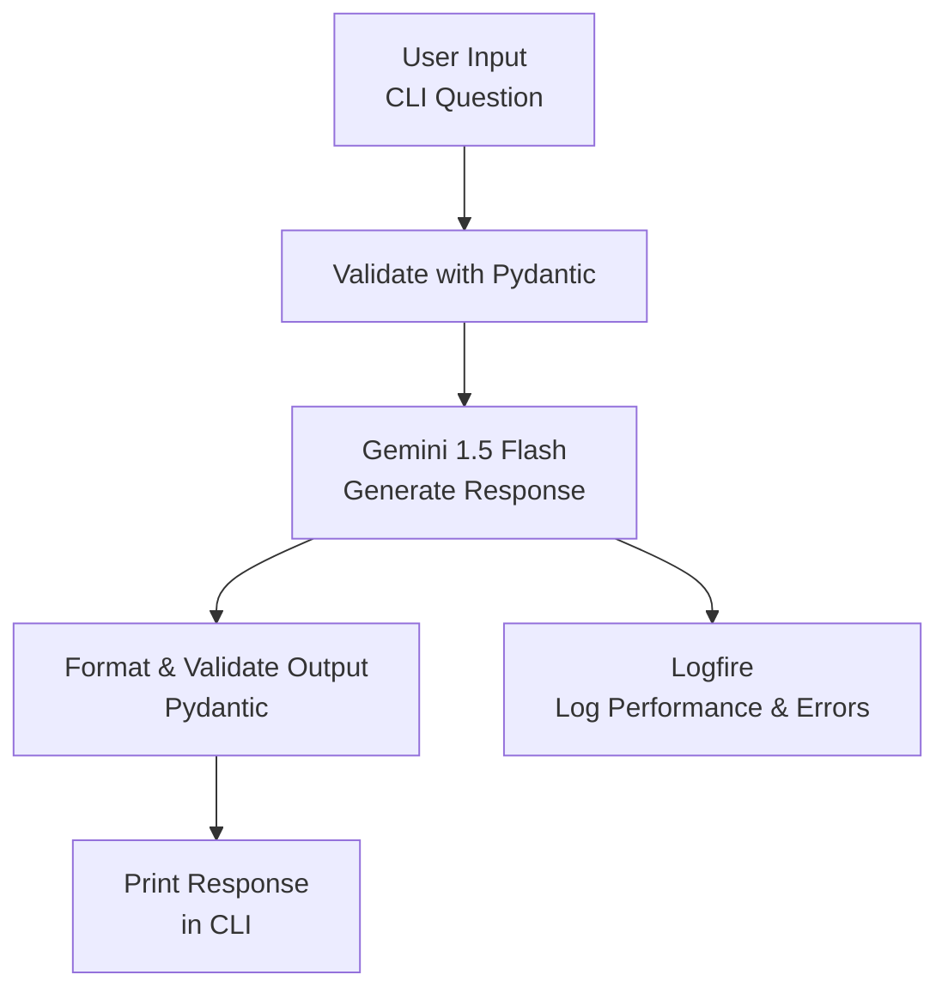

# Level 1: Hello World Agent with Pydantic AI 

##  Overview

This beginner-friendly project creates a simple "Hello World" AI agent using **Pydantic AI** and Google’s **Gemini** model.\
The agent accepts questions via a command-line interface (CLI), validates inputs, generates concise answers, and logs interactions for debugging.\
Perfect for those starting with AI and Python!

---

##  Features

- Interactive CLI: Ask questions and receive clear, short answers.
- Gemini-Powered: Uses Google’s Gemini 1.5 Flash model for responses.
- Pydantic Validation: Ensures clean input/output with Pydantic schemas.
- Logfire Logging: Tracks performance and errors for observability.

---

##  Requirements

- **Python**: 3.8 or higher
- **Packages**:
  ```bash
  pip install google-generativeai pydantic pydantic-ai logfire python-dotenv
  ```
- **API Key**: Google Gemini API key (get from [Google AI Studio](https://aistudio.google.com/)).
- **Optional**: Logfire token for logging (get from [Pydantic Logfire](https://pydantic.dev/logfire)).

---

##  Setup
###  Create a `.env` File

In VS Code:
- Create a new file named `.env`.

Add these lines (replace with your actual keys):

```env
GOOGLE_API_KEY=your_gemini_api_key
LOGFIRE_TOKEN=your_logfire_token
```

---

###  Run the Agent

```bash
python gemini_agent.py
```

- Enter a question (e.g., `What are the principles of OOPS?`).
- View the response in the terminal.
- Type `quit` or `exit` to stop (or press `Ctrl+C`).
- Check logs at Logfire if using a token.

---

## 📊 Flow Diagram




## Output Screenshot


---

##  Troubleshooting

### Missing API Key

- Ensure `GOOGLE_API_KEY` is set in `.env`.
- Get key from [Google AI Studio](https://aistudio.google.com/).

---

### Logfire Issues

- Check `LOGFIRE_TOKEN` in `.env`.
- If `LogfireNotConfiguredWarning` appears, set:
  ```bash
  export LOGFIRE_IGNORE_NO_CONFIG=1
  ```
  or add to `.env`:
  ```env
  LOGFIRE_IGNORE_NO_CONFIG=1
  ```

---
