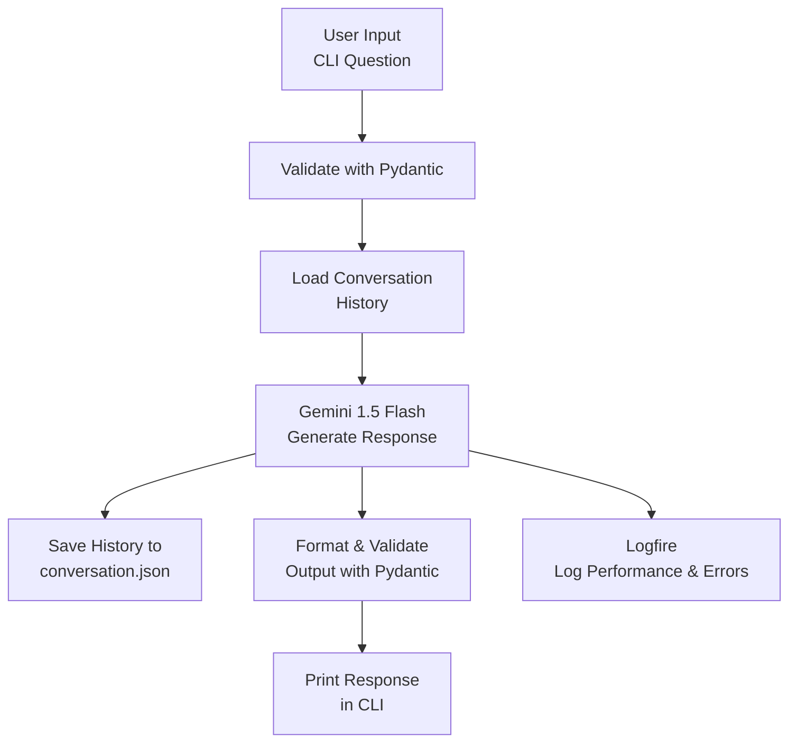

# Level 2: Conversational AI Agent with Pydantic AI 

##  Overview
This beginner-friendly project builds a **Conversational AI Agent** using [Pydantic AI](https://github.com/pydantic/pydantic-ai) and Google's Gemini model. It’s a step up from Level 1, introducing **Conversational Memory**, which lets the agent remember previous questions and answers to provide context-aware responses. For example, if you share your interests, the agent uses that context for follow-up questions. This is perfect for beginners learning AI, Python, and how agents maintain conversations!

### What is Conversational Memory?
Conversational Memory means the agent keeps track of your conversation history (e.g., what you asked and its responses) to make answers more relevant. For instance:

> You say: "I’m Tripty, interested in compiler design and ML. What are career options?"

> The agent responds: "Careers in compiler engineering or ML research are great fits."

> You ask: "What textbooks align with my interests?"

> The agent uses the history (knowing you like compiler design and ML) to suggest: "Try 'Compilers: Principles, Techniques, and Tools' and 'Deep Learning'."

### How Pydantic AI Helps
Pydantic AI structures the agent by:
- **Validating Inputs/Outputs**: Ensures questions and responses follow a defined format using Pydantic schemas.
- **Organizing Logic**: Makes the agent’s code clean and reusable.
- **Integrating with Gemini**: Combines Pydantic’s structure with Gemini’s AI to generate answers.

The agent saves the conversation to a `conversation.json` file, so you can review past exchanges.

##  Features
- **Conversational Memory**: Remembers previous responses to provide context-aware and coherent replies.
- **Interactive CLI**: Ask questions and get concise answers via the command line.
- **Gemini-Powered**: Uses Google’s Gemini 1.5 Flash model for responses.
- **Pydantic Validation**: Ensures clean input/output with schemas.
- **Logfire Logging**: Tracks performance and errors for debugging.
- **JSON Saving**: Stores conversation history in a JSON file.

##  Requirements
- **Python**: 3.8 or higher
- **Packages**:
  ```bash
  pip install google-generativeai pydantic pydantic-ai logfire python-dotenv
  ```
- **API Key**: Google Gemini API key (get from [Google AI Studio](https://aistudio.google.com/)).
- **Optional**: Logfire token for logging (get from [Logfire dashboard](https://pydantic.dev/logfire)).

##  Setup
**Create a `.env` File**:
   In VS Code:
   - Create a new file: `File > New File > .env`.
   - Add:
     ```
     GOOGLE_API_KEY=your_gemini_api_key
     LOGFIRE_TOKEN=your_logfire_token
     GEMINI_MODEL=gemini-1.5-flash
     CONVERSATION_FILE=conversation.json
     ```
   - Replace `your_gemini_api_key` with your key from Google AI Studio.
   - Get `your_logfire_token` from [Logfire](https://pydantic.dev/logfire) (optional; skip if not using logging).
   - `GEMINI_MODEL` and `CONVERSATION_FILE` are optional (defaults provided).


##  Flow Diagram
The agent processes user input as follows:



##  Example


"Real-Time Output Monitoring with Pydantic Logfire"


**Saved conversation.json**:
```json
{
  "conversation": [
    {
      "user": "My name is Tripty, interested in compiler design and ML. What are career options?",
      "response": "Careers in compiler engineering or ML research are great fits."
    },
    {
      "user": "What textbooks align with my interests?",
      "response": "Try 'Compilers: Principles, Techniques, and Tools' and 'Deep Learning'."
    }
  ]
}
```


##  Troubleshooting
- **Missing API Key**:
  - Ensure `GOOGLE_API_KEY` is in `.env`. Get one from [Google AI Studio](https://aistudio.google.com/).
  - Open `.env` in VS Code (`Ctrl+Shift+E`) to verify.
- **Logfire Issues**:
  - If `LogfireNotConfiguredWarning` appears, check `LOGFIRE_TOKEN` in `.env` or ensure `LOGFIRE_IGNORE_NO_CONFIG=1` is set in the code.
  - Verify token at [Logfire](https://pydantic.dev/logfire).
- **JSON File**:
  - Ensure write permissions for `conversation.json`.
  - Check `CONVERSATION_FILE` in `.env` if using a custom path.
- **Errors**:
  - Run `pip show pydantic-ai` in VS Code’s terminal to check the version.
  - Update: `pip install --upgrade pydantic-ai`.
- **Logs**: View traces at [Logfire](https://pydantic.dev/logfire).
