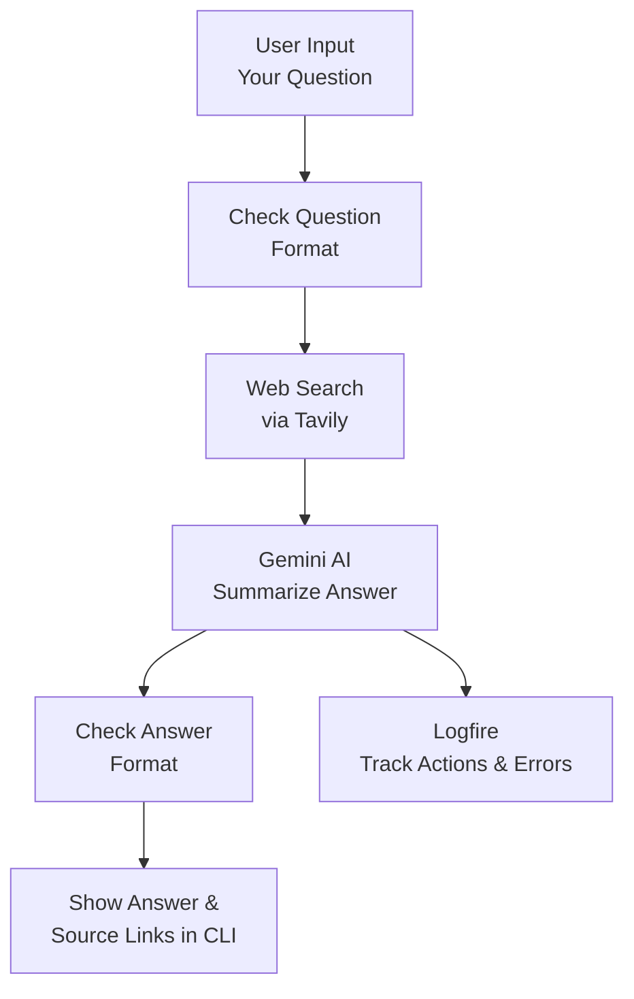

# Level 3: Pydantic Ai Agent with Web Search Tool

##  Overview
This beginner-friendly project creates an AI Assistant that answers your questions by searching the web, similar to how Perplexity works. It uses a web search tool called Tavily to find up-to-date information and combines it with Google’s Gemini AI to provide clear, concise answers with source links. This project is perfect for beginners who want to learn how AI can leverage real-time data to deliver accurate and context-aware responses.

### What is a Web Search Tool?
A **web search tool** lets the AI look up current information online to answer your questions. For example:
> You ask: “What is the latest on US tariffs?”

> The assistant searches the web using Tavily, finds recent news, and answers: “President Trump announced 30% tariffs on EU and Mexico goods starting August 1, 2025, prompting EU trade talks.”


> It lists source websites (like Reuters or Wikipedia) so you can check the information yourself.


### How Pydantic AI Helps
[Pydantic AI](https://ai.pydantic.dev/) is a Python tool that makes the program organized and reliable:
- **Organizes Questions and Answers**: It ensures your questions and the AI’s answers follow a clear structure (like a form with specific fields), so there are no mistakes in how data is handled.
- **Manages the Web Search Tool**: It connects the Tavily search tool to the AI, making sure the search results are used correctly to answer your question.
- **Keeps Code Simple**: It handles complex AI tasks behind the scenes, so you can focus on writing simple code to ask questions and get answers.
- **Prevents Errors**: It checks that all inputs (like your question) and outputs (like the answer and source links) are correct before showing them.

This makes the program easier to build and understand, especially for learning AI and Python!

##  Features
- **Web Search**: Uses Tavily to find real-time information online.
- **Smart Answers**: Combines search results with Google’s Gemini AI to give clear, short answers (max 100 words).
- **Source Links**: Lists website URLs used for the answer, numbered for easy reference.
- **Interactive CLI**: Ask questions in the command line and see answers with sources.
- **Error Logging**: Uses Logfire to track performance and catch problems for debugging.


##  Requirements
- **Python**: 3.8 or higher (you’re using Python 3.9, which works great!)
- **Packages**:
  ```bash
  pip install google-generativeai httpx pydantic pydantic-ai logfire python-dotenv
  ```
- **API Keys**:
  - Google API key for Gemini (get from [Google AI Studio](https://aistudio.google.com/)).
  - Tavily API key for web search (get from [Tavily](https://app.tavily.com/)).
  - Optional: Logfire token for logging (get from [Logfire](https://pydantic.dev/logfire)).
- **Internet**: Needed for web searches.

## ⚙️ Setup
**Create a `.env` File**:
   - Go to `File > New File`, name it `.env`, and add:
     ```
     GOOGLE_API_KEY=your_google_api_key
     TAVILY_API_KEY=your_tavily_api_key
     LOGFIRE_TOKEN=your_logfire_token
     ```
   - Replace `your_google_api_key` with your key from [Google AI Studio](https://aistudio.google.com/).
   - Replace `your_tavily_api_key` with your key from [Tavily](https://app.tavily.com/).
   - Get `your_logfire_token` from [Logfire](https://pydantic.dev/logfire) (optional; skip if not using logging).
   


## 📊 How It Works (Code Explanation)
Here’s what each part of `main.py` does, explained simply:
- **Answer (Schema)**: Defines the structure for the AI’s response, with an `answer` (the text you see) and `sources` (list of website URLs).
- **TavilySearchInput (Schema)**: Sets up the structure for web search requests, like the question you ask and search settings (e.g., how recent the results should be).
- **tavily_search_tool (Function)**: Sends your question to Tavily’s website, gets search results (like news or articles), and returns them to the AI.
- **get_answer (Function)**: Takes your question, uses the web search tool to find information, asks Gemini AI to summarize it into a short answer, and adds source links.
- **main (Function)**: Runs the program, sets up the AI and web search, shows a command-line interface to ask questions, and prints answers with sources.
- **Logfire**: Logs what the program does (like how many sources it found) to help find problems if something goes wrong.

The **Pydantic AI agent** ties everything together by:
- Making sure the question and answer formats are correct.
- Connecting the web search tool to the AI.
- Keeping the code organized so it’s easy to understand and fix.

##  Flow Diagram
This diagram shows how the assistant processes your question:



## Output Screenshot


"Real-Time Output Monitoring with Pydantic Logfire"


##  Troubleshooting
- **API Key Problems**:
  - Check `GOOGLE_API_KEY` in `.env` is correct (from [Google AI Studio](https://aistudio.google.com/)).
  - Check `TAVILY_API_KEY` (from [Tavily](https://app.tavily.com/)).
  - Open `.env` in VS Code (`Ctrl+Shift+E`) to verify.
- **Web Search Issues**:
  - Ensure you have an internet connection.
  - Confirm your Tavily API key is valid at [Tavily](https://app.tavily.com/).
- **Logfire Errors**:
  - If logging fails, check `LOGFIRE_TOKEN` in `.env` or skip it (it’s optional).
  - View logs at [Logfire](https://pydantic.dev/logfire).
- **Program Errors**:
  - Check package versions: `pip show pydantic-ai google-generativeai httpx`.
  - Update: `pip install --upgrade google-generativeai httpx pydantic pydantic-ai logfire python-dotenv`.


