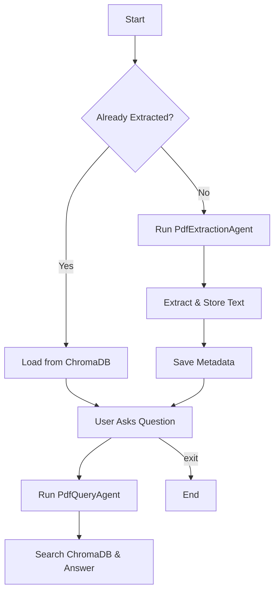

#  PDF Question-Answering System with Pydantic AI

##  Objective
Level4 is a simple Python app that lets you ask questions about any text-based PDF, like a resume or a Compiler Design book. It reads the PDF, saves its text in a vector database (ChromaDB), and then lets you ask questions like:

> "What is my CGPA?" or "What is lexical analysis?"

It uses **Pydantic AI** and **Google Gemini** to process and understand your PDF.

---


##  Features

-  Reads any text-based PDF
-  Stores the text in ChromaDB for fast search
-  Uses smart AI agents to extract and answer questions
-  Keeps metadata to avoid re-processing the same PDF
-  Interactive Q&A session where you can ask anything
-  Uses **Logfire** for span-level tracing and debugging

---


##  Requirements
- **Python**: 3.8 or higher (you’re using Python 3.9, which works great!)
- **Packages**:
  ```bash
  pip install pydantic-ai==0.2.17 python-dotenv logfire PyPDF2 chromadb sentence-transformers
  ```
- **API Keys**:
  - Google API key for Gemini (get from [Google AI Studio](https://aistudio.google.com/)).
  - Logfire token for logging (get from [Logfire](https://pydantic.dev/logfire)).


##  Code Overview

### `main.py`

- Loads environment variables and command-line arguments
- Checks if the PDF was already processed (via metadata)
- If needed, runs extraction and stores content
- Starts an **interactive Q&A loop** where the user can ask questions

### `agents.py`

#### `PdfExtractionAgent`

- Validates the PDF file path and type
- Extracts text from the PDF and splits it into chunks 
- Saves the chunks in ChromaDB (vector store)
- Saves metadata to `pdf_metadata.json` to avoid reprocessing

#### `PdfQueryAgent`

- Loads the relevant ChromaDB collection from metadata
- Retrieves chunks similar to the user’s question
- Uses Gemini to generate a short, accurate answer 


## Flow Diagram



## Output Screenshot 


Monitor extraction and query events in real-time with Pydantic Logfire integration.


##  Troubleshooting
- **API Key Problems**:
  - Check `GOOGLE_API_KEY` in `.env` is correct (from [Google AI Studio](https://aistudio.google.com/)).
  - Open `.env` in VS Code (`Ctrl+Shift+E`) to verify.

- **Logfire Errors**:
  - If logging fails, check `LOGFIRE_TOKEN` in `.env` or skip it (it’s optional).
  - View logs at [Logfire](https://pydantic.dev/logfire).

- **Program Errors**:
  - Check package versions: `pip show pydantic-ai `.
  - Update: `pip install --upgrade pydantic-ai==0.2.17 python-dotenv logfire PyPDF2 chromadb sentence-transformers`.


