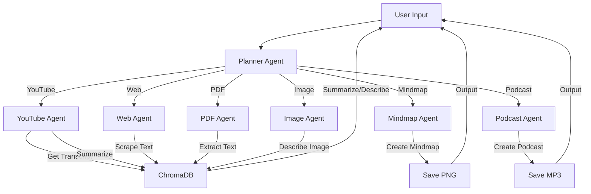

# Multi-Agent using Pydantic AI

## Overview
Welcome to the Multi-Agent Content Planner, a powerful Python-based system that harnesses specialized AI agents to process, analyze, and transform content from YouTube videos, web pages, PDFs, and images. Whether you're summarizing a video, generating a podcast, creating a mindmap, or answering questions about a document, this tool makes it seamless and efficient. With a modular design, robust error handling, and an intuitive interface, it’s perfect for beginners and advanced users alike.

## Features

- Multi-Agent Architecture – Planner Agent routes tasks to specialized agents.
- YouTube Support – Extracts transcripts, summarizes videos, and answers user queries.
- Web & PDF Handling – Scrapes web pages and extracts PDFs content using PyPDF2.
- Image Analysis – Generates rich descriptions for local images using Gemini API.
- Mindmap Generation – Creates visual mindmaps from text using Graphviz.
- Podcast Generation – Converts content into JSON-based scripts and audio via ElevenLabs.
- Context & Metadata Storage – Stores all content, summaries, and metadata in ChromaDB & JSON files.
- Real-Time Logging – Debug and monitor agent activity using Logfire.


##  Requirements
- **Python**: 3.8 or higher (you’re using Python 3.9, which works great!)
- **Packages**:
  ```bash
  pip install pydantic-ai==0.2.17 python-dotenv logfire google-api-python-client
  ```
- **API Keys**:
  - Google API key for Gemini (get from [Google AI Studio](https://aistudio.google.com/)).
  - Logfire token for logging (get from [Logfire](https://pydantic.dev/logfire)).
  - Sign up and get your key from [ElevenLabs](https://www.elevenlabs.io/)
  - Download and install from [FFmpeg.org](https://ffmpeg.org/download.html)
  - Install Graphviz from  [Download installer](https://graphviz.org/download/)


## Workflow Diagram

##  Agents and Their Responsibilities

| Agent Name        | Role / Task                                                                 |
|-------------------|------------------------------------------------------------------------------|
| **Planner Agent** | Parses user input, detects resource type, and delegates tasks to other agents. |
| **YouTube Agent** | Extracts transcripts from YouTube, summarizes videos, and answers questions.  |
| **Web Agent**     | Scrapes and summarizes web pages; handles user queries on web content.       |
| **PDF Agent**     | Extracts and summarizes PDF content; answers questions based on PDF text.    |
| **Image Agent**   | Generates descriptive analysis of images and handles image-based queries.    |
| **Mindmap Agent** | Creates mindmaps from text using Graphviz.                                   |
| **Podcast Tools** | Generates podcast-style scripts and audio using ElevenLabs.                  |

---

## Output 
- [Image ](https://github.com/triptyy/Assigment_Pydyantic/blob/a35a63240fcb14ad467743cb10beb0187a4fe0d1/assests/dog.jpeg).

  

- [PDF Link](https://github.com/triptyy/Assigment_Pydyantic/blob/a35a63240fcb14ad467743cb10beb0187a4fe0d1/assests/solarsystem.pdf).

  

- [YouTube Link](https://www.youtube.com/watch?v=8KkKuTCFvzI)

  

  
  


- [Web Link](https://en.wikipedia.org/wiki/Time_dilation)

  
  

- [PodCast Output](https://github.com/triptyy/Assigment_Pydyantic/blob/6c7b7bcf5f75ce8097bede8f92b3432d151d3d36/assests/podcast%20audio%20file.mp3)
  
- 


##  Troubleshooting
- **API Key Problems**:
  - Check `GOOGLE_API_KEY` in `.env` is correct (from [Google AI Studio](https://aistudio.google.com/)).
  - Open `.env` in VS Code (`Ctrl+Shift+E`) to verify.

- **Logfire Errors**:
  - If logging fails, check `LOGFIRE_TOKEN` in `.env` or skip it (it’s optional).
  - View logs at [Logfire](https://pydantic.dev/logfire).


