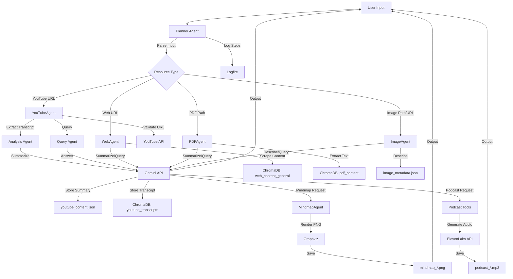

# Multi-Agent Level5

## Overview
Welcome to the Multi-Agent Content Planner, a powerful Python-based system that harnesses specialized AI agents to process, analyze, and transform content from YouTube videos, web pages, PDFs, and images. Whether you're summarizing a video, generating a podcast, creating a mindmap, or answering questions about a document, this tool makes it seamless and efficient. With a modular design, robust error handling, and an intuitive interface, it’s perfect for beginners and advanced users alike.

## Features

- **Content Processing**:
  - Summarizes web pages, YouTube video transcripts, and PDFs.
  - Describes images (local files or URLs) with detailed analysis.
  - Generates mindmaps from summaries or descriptions using Graphviz.
  - Creates podcasts with scripts and audio from summaries using ElevenLabs API.
  - Answers specific questions about processed content.
- **Multi-Agent Architecture**:
  - Delegates tasks to six specialized agents: `YouTubeAgent`, `WebAgent`, `PDFAgent`, `ImageAgent`, `MindmapAgent`, and `PodcastAgent`.
- **Interactive Mode**:
  - Provides a chatbot interface for continuous user interaction.
  - Supports follow-up queries using context from previous tasks.
- **Context Persistence**:
  - Stores the last processed resource and its summary/description in ChromaDB for follow-up tasks.
  - Caches image descriptions in `image_metadata.json`.
- **Error Handling**:
  - Validates URLs, PDF paths, and image files/URLs before processing.
  - Logs detailed errors and operations via Logfire for debugging.
- **Extensibility**:
  - Modular design allows easy integration of new agents or tools.


## Requirements

- **Python**: 3.8+
- **Dependencies**:
  ```bash
  pip install pydantic-ai==0.2.17 python-dotenv logfire google-api-python-client
  ```
- **Environment Variables** (in `.env`):
  ```plaintext
  GEMINI_API_KEY=your_gemini_key
  LOGFIRE_TOKEN=your_logfire_token
  ELEVENLABS_API_KEY=your_elevenlabs_api_key
  FFMPEG_PATH=/path/to/ffmpeg/bin  # Optional
  ```
- **Hardware**: Standard PC with internet access.

### **Run Interactive Mode**:
   ```bash
   python main.py --interactive
   ```
   - Enter commands like:
     ```
     summarize https://www.example.com
     describe C:\Users\tript\OneDrive\Desktop\py\Level5\dog.jpeg
     color of dog C:\Users\tript\OneDrive\Desktop\py\Level5\dog.jpeg
     create a mindmap of https://www.youtube.com/watch?v=VIDEO_ID
     create podcast https://www.nasa.gov
     short description
     create podcast for the above resource
     ```
   - Type `exit` to quit.

### **Run Single Query**:
   ```bash
   python main.py --query "summarize https://www.example.com"
   ```

### **Output Files**
- Mindmaps: mindmap_YYYYMMDD_HHMMSS_*.png
- Podcasts: podcast_*.mp3 and script_*.json
- Metadata: image_metadata.json, pdf_metadata.json, youtube_content.json
- ChromaDB: Stored in ./chroma_db

## How It Works (Workflow)

The Multi-Agent Content Planner orchestrates tasks through a central Planner Agent that delegates to specialized agents based on the input type and task. Here’s the workflow for processing content, including YouTube-specific tasks:

- **Input Parsing**:
    - The user provides a request via command line (e.g., "summarize https://www.youtube.com/watch?v=VIDEO_ID" or "describe image.jpg").
    - The Planner Agent parses the input to identify the resource type (YouTube, web, PDF, image) and task (summarize, describe, mindmap, podcast, or question).
- **Resource Type Detection**:
    - For URLs, the Planner uses a detect_url_type tool to classify as YouTube or web.
    - For local files, it checks extensions (.pdf, .jpg, .png, etc.).
    - For follow-up requests (e.g., "short description of above"), it retrieves stored context from ChromaDB.
- **YouTube-Specific Workflow**:
    - Validation: Checks YouTube URL validity and transcript availability using youtube-transcript-api.
    - Transcript Extraction: Retrieves the English transcript, and the Analysis Agent generates a 150-250 word summary using the Gemini API (google-gla:gemini-1.5-pro).
    - Storage: Saves the summary to youtube_content.json and transcript to ChromaDB (youtube_transcripts).
    - Q&A: The Query Agent answers user questions based on the stored summary or transcript, displaying answers in the terminal.
- **Other Content Types**:
    - Web Pages: Scrapes text using BeautifulSoup, stores in ChromaDB (web_content_general), and summarizes (150-750 words).
    - PDFs: Extracts text with PyPDF2, stores in ChromaDB (pdf_content), and summarizes (150-250 words).
    - Images: Generates 100-150 word descriptions using Gemini API, stored in image_metadata.json.
- **Task Delegation**:
    - Summaries, descriptions, or answers are generated using the Gemini API.
    - Mindmaps are created as PNGs via Graphviz by the MindmapAgent.
    - Podcasts are generated as JSON scripts and MP3 audio via ElevenLabs by the Podcast Tools.
- **Context Management**:
    - Stores the last processed resource, its type, and summary in ChromaDB for follow-up tasks.
    - Metadata (e.g., image descriptions, PDF collection names) is saved in JSON files.
- **Logging**:
    - All steps, including YouTube processing, are logged via Logfire for debugging and monitoring.
- **Output Delivery**:
    - Results (summaries, answers, mindmap/podcast file paths) are returned to the user via the command-line interface.


## Workflow Diagram


## Agents and Their Work

The system employs a multi-agent architecture with specialized agents handling specific tasks.  

###  Planner Agent (`main.py`)

- **Role**: Central coordinator that parses inputs, detects resource types, and delegates tasks.
- **Tasks**:
  - Uses tools like `detect_url_type` to classify inputs.
  - Manages context and persistence using **ChromaDB** for follow-up requests.

---

###  YouTubeAgent (`youtube.py`)

- **Model**: `google-gla:gemini-1.5-pro`.
- **Role**: Manages YouTube video processing using `youtube-transcript-api`.
- **Tasks**:
  - **Analysis Agent**: Uses `analyze_youtube_content` to extract transcripts and generate 150–250 word summaries.
  - **Query Agent**: Uses `query_youtube_content` to answer questions based on stored summaries or transcripts.
  - Stores:
    - Summaries in `youtube_content.json`.
    - Transcripts in **ChromaDB** (`youtube_transcripts`).

---

###  WebAgent (`web.py`)

- **Model**: `google-gla:gemini-1.5-pro`.
- **Role**: Scrapes web content using BeautifulSoup.
- **Tasks**:
  - Summarizes content (150–750 words).
  - Answers queries about the web content.
  - Stores data in **ChromaDB** (`web_content_general`).

---

###  PDFAgent (`Pdf.py`)

- **Model**: `google-gla:gemini-1.5-pro`.
- **Role**: Extracts text from PDFs using PyPDF2.
- **Tasks**:
  - Summarizes PDFs (150–250 words).
  - Answers queries about the PDF.
  - Stores data in **ChromaDB** (`pdf_content`) and `pdf_metadata.json`.

---

###  ImageAgent (`image.py`)

- **Model**: `google-gla:gemini-1.5-pro`.
- **Role**: Analyzes images (local or URL-based) using Gemini API.
- **Tasks**:
  - Generates descriptive analysis (100–150 words).
  - Answers queries about image content.
  - Stores metadata in `image_metadata.json`.

---

###  MindmapAgent (`mindmap.py`)

- **Role**: Generates hierarchical mindmaps from summaries.
- **Tasks**:
  - Creates Graphviz DOT files.
  - Renders PNG mindmap images.
  - Stores data in **ChromaDB** (`mindmap_dots`).

---

###  Podcast Tools (`podcast.py`)

- **Role**: Generates podcast scripts and audio.
- **Tasks**:
  - Creates JSON scripts (~7 sentences, two speakers).
  - Generates MP3 audio using ElevenLabs (voices: Sarah and Adam).

---


##  Pydantic AI Role

Pydantic AI enhances the system’s modularity, type safety, and error handling.

- **Input Validation**:
  - Uses Pydantic models (e.g., `YouTubeAnalysisInput`, `WebUrlInput`, `ImageAnalysisInput`, `PDFAnalysisInput`) to validate URLs, file paths, and task parameters.
  - Ensures robust handling of invalid URLs, missing transcripts, or incorrect file formats.

- **Tool Framework**:
  - Defines tools for each agent, including:
    - `analyze_youtube_content`: Summarizes YouTube transcripts.
    - `query_youtube_content`: Answers questions about YouTube content.
    - `create_web_content_extractor_tool`: Scrapes web pages.
    - `create_image_analysis_tool`: Describes images.
    - `create_pdf_content_extraction_tool`: Extracts PDF text.
    - `create_mindmap_generation_tool`: Generates mindmap DOT files.
    - `create_podcast_script_tool`: Creates podcast scripts.

- **Structured Data**:
  - Manages JSON storage for summaries and metadata (`youtube_content.json`, `image_metadata.json`, `pdf_metadata.json`).
  - Stores content and metadata in **ChromaDB** for efficient retrieval and querying.

- **Error Handling**:
  - Validates inputs to prevent runtime errors (e.g., invalid YouTube URLs or missing files).
  - Handles API errors (e.g., Gemini 429/503) with retries and user-friendly messages.
  - Logs errors and process steps via **Logfire** for debugging.


## **Troubleshooting**:
   - Check Logfire dashboard: `https://logfire-eu.pydantic.dev/triptytiwari07/pydantic`.
   - Verify file paths, API keys, and tool installations.
   - Ensure images/PDFs are valid (e.g., open images in a viewer, PDFs in a reader).
   - Use public URLs (e.g., Imgur) for images if local files fail.
   - Check `image_metadata.json` for cached image descriptions.
